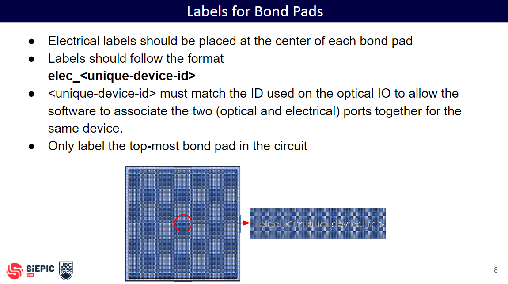
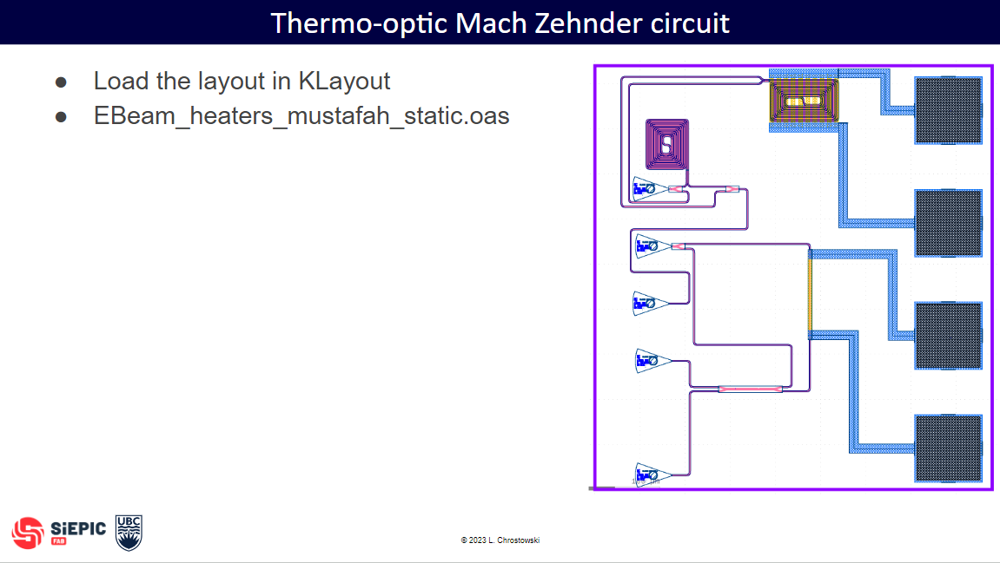
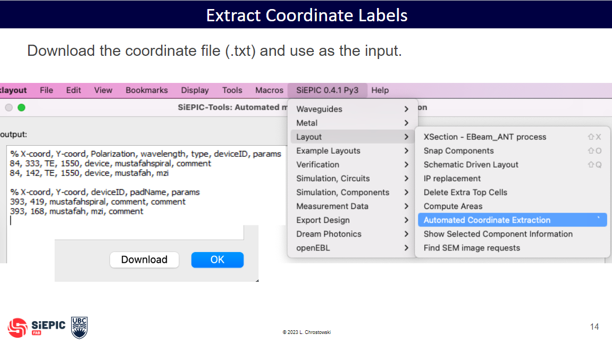
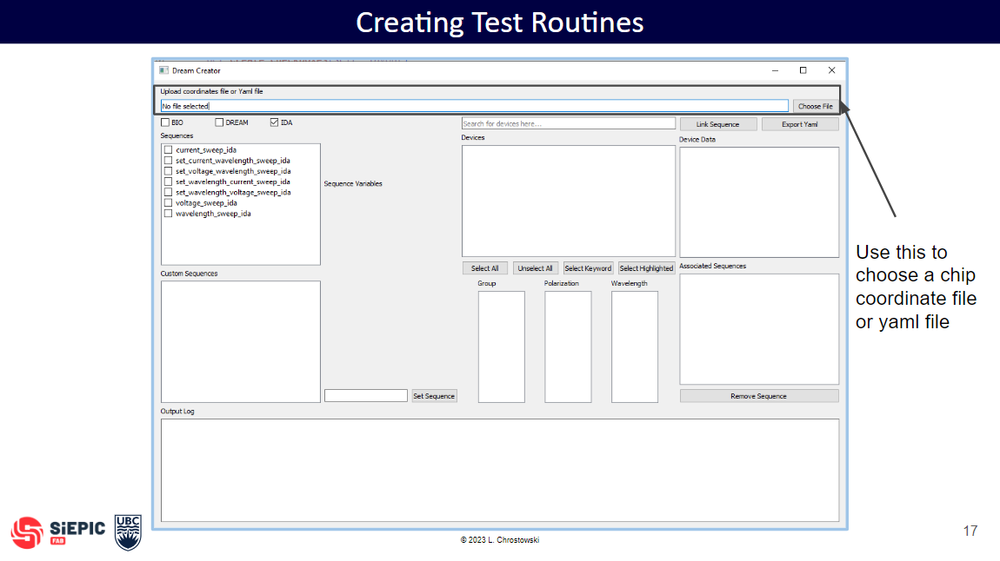
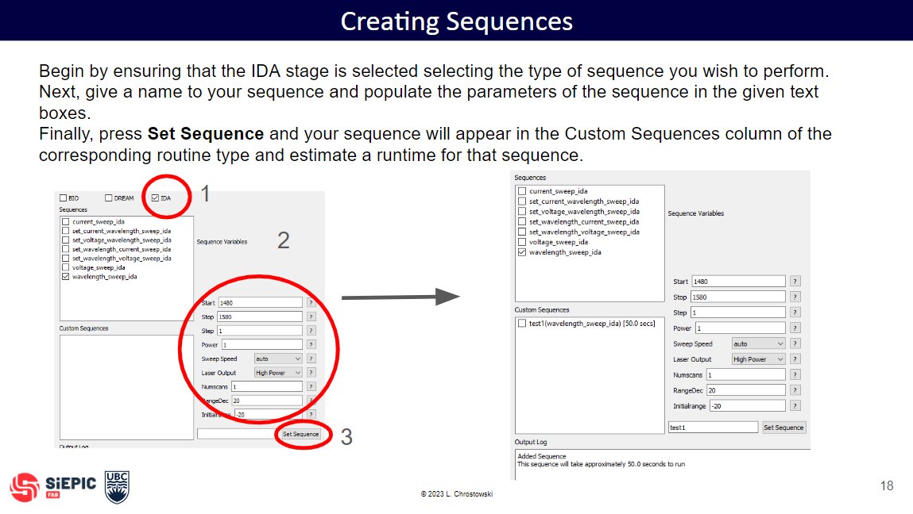

# SiEPIC Test Creator

[](https://opensource.org/licenses/MIT)
[](https://codecov.io/gh/SiEPIC/SiEPIC_testcreator)

A tool for creating YAML files for use across UBC probe stations. This aplication features a UI that allows students and users to link on chip devices to custom test sequences.

## Setup

1. **Prerequisites/Labelling:** Python 3.10 and above



  
2. **Installation**


## Usage

Find here instruction on the work flow of the application

The GUI can be launched using the terminal or via python. For an example using python, see [run_gui.py](example/run_gui.py). To launch the GUI via the terminal, execute the command below:
```
SiEPIC_TestCreator --gui
```









## License

This project is licensed under the MIT License - see the [LICENSE.md](LICENSE.md) file for details.
