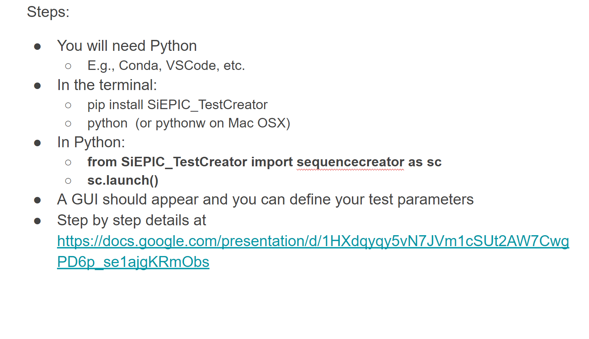

# SiEPIC Test Creator

A tool for creating YAML files for use across UBC probe stations. This aplication features a UI that allows students and users to link on chip devices to custom test sequences.

## Installation

1. **Prerequisites/Labelling:** Python 3.10 and above

  
2. **Instructions:**

## Usage

Find here instruction on the work flow of the application

## License

This project is licensed under the MIT License - see the [LICENSE.md](LICENSE.md) file for details.
